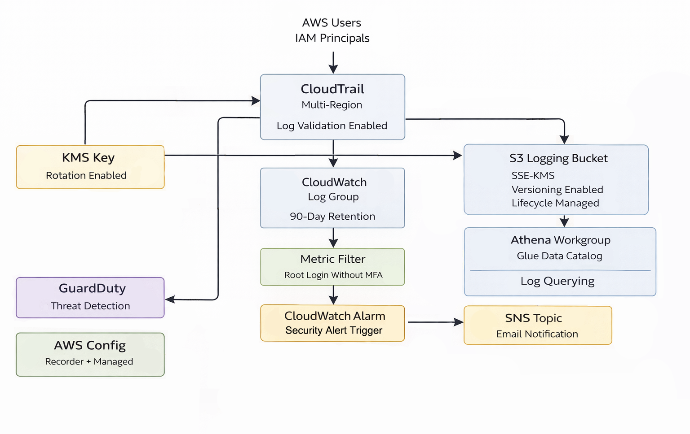

## AWS Logging & Observability Pipeline

Designed and validated a centralized AWS logging and observability pipeline using CloudTrail, CloudWatch, AWS Config, GuardDuty and Athena. This project demonstrates how to collect, query and act on operational signals across an AWS environment using native services.

---

## Overview

This project focuses on building centralized logging, monitoring and configuration visibility across AWS services. It covers API activity logging, configuration state tracking, metric-based alerting and log analysis using AWS-native tools.

The goal is to demonstrate how cloud environments can be made observable and auditable, enabling engineers to understand system behavior, detect anomalies and support troubleshooting and governance at scale.

---

## What I Built

- Multi-region CloudTrail setup capturing all AWS API activity.
- Centralized log storage in Amazon S3.
- AWS Config recording resource configuration changes and compliance state.
- CloudWatch metric filters and alarms for key operational events.
- Athena-based querying of CloudTrail logs for analysis and investigation.
- End-to-end resource lifecycle cleanup after validation.

---

## Diagram

---

## Implementation Highlights

- Enabled multi-region CloudTrail to capture all management events.
- Delivered CloudTrail logs to a dedicated S3 bucket.
- Enabled AWS Config to record supported resource types.
- Applied managed AWS Config rules to observe configuration drift.
- Created CloudWatch metric filters and alarms based on CloudTrail events.
- Queried CloudTrail logs using Athena for API activity analysis.
- Removed all logging, monitoring and storage resources after validation.
   
---

## Screenshots

Selected screenshots are included in the `screenshots/` directory to validate configuration and data flow.

---

## JSONs Table

Sample JSON files are included in the `/sample_jsons/` directory for reference.

| Order | File Name                               | What it Shows                                |
|-------|-----------------------------------------|----------------------------------------------|
| 1     | awsconfig_rule_noncompliant_sample.json | AWS Config non-compliance finding JSON       |
| 2     | cloudtrail_event_sample.json            | Sample CloudTrail event JSON                 |
| 3     | guardduty_sample_finding.json           | Sample GuardDuty finding JSON                |

---

## Key Takeaways

- Centralized logging is essential for understanding AWS account activity.
- CloudTrail provides a reliable source of API-level events.
- AWS Config enables visibility into configuration changes over time.
- CloudWatch converts logs into actionable operational signals.
- Athena allows flexible, ad-hoc analysis of logs stored in S3.
- Observability pipelines require deliberate teardown to control cost.
  
---

## Relevance to Cloud & Platform Engineering

This project reflects real-world platform responsibilities:
- Centralized logging and auditability.
- Configuration visibility and drift detection.
- Metric-based alerting and monitoring.
- Log analysis using managed AWS services.
- Operational lifecycle management.

---

## References

- [AWS CloudTrail Documentation](https://docs.aws.amazon.com/awscloudtrail/latest/userguide/cloudtrail-user-guide.html)
- [AWS GuardDuty Documentation](https://docs.aws.amazon.com/guardduty/latest/ug/what-is-guardduty.html)
- [AWS Config Documentation](https://docs.aws.amazon.com/config/latest/developerguide/WhatIsConfig.html)
- [AWS CloudWatch Documentation](https://docs.aws.amazon.com/AmazonCloudWatch/latest/monitoring/WhatIsCloudWatch.html)
- [AWS Athena Documentation](https://docs.aws.amazon.com/athena/latest/ug/what-is.html)

---

## Contact

Maintained by Sebastian Silva C. – Berlin, Germany  
LinkedIn: https://www.linkedin.com/in/sebastiansilc 
